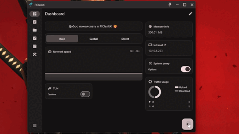
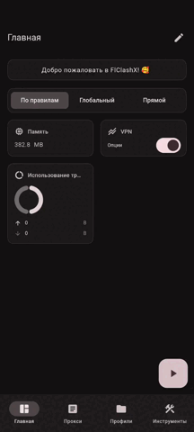

<div>

[**English**](README_EN.md)

</div>

## FlClashX

[](https://github.com/pluralplay/FlClashX/releases/)
[](https://github.com/pluralplay/FlClashX/releases/)
[](LICENSE)

[](https://t.me/FlClashX)

Форк многоплатформенного прокси-клиента FlClash на основе ClashMeta, простого и удобного в использовании, с открытым исходным кодом и без рекламы.

Десктопный вид:

<p style="text-align: center;">
    
</p>

Мобильный вид:

<p style="text-align: center;">
    
</p>

## Добавленный функционал

🛠️ Исправлены стандартные настройки: режим поиска процессов вкл, режим tun вкл, режим системного прокси выкл, режим отображения списка прокси list, изменена работа камеры при добавлении подписки через QR.

📱 **Поддержка 120Гц дисплеев на Android:** Добавлена поддержка высокочастотных дисплеев (120Гц) на устройствах Android для более плавных анимаций и прокрутки.

🗑️ **Очистка данных приложения:** Добавлена кнопка "Очистить данные" в настройках приложения, которая удаляет все профили из папки profiles. Полезно для устранения неполадок или сброса приложения.

🇷🇺 Добавлен русский язык в установщик и переработана локаль в приложении

✈️ Передача HWID в панель (Работает только с <a href="https://github.com/remnawave/panel">Remnawave</a>)

💻 Добавлен новый виджет "Анонсы". Передаёт анонсы из панели в виджет. (Работает только с <a href="https://github.com/remnawave/panel">Remnawave</a>)

📺 Оптимизация управления на Android TV

- добавлена кнопка "Вставить" для меню добавления подписки по ссылке
- добавлена кнопка выбора профиля
- добавлена передача профиля с мобильного приложения через QR-код

💻 macOS - приложение в нативной строке состояния (status bar) вместо оконного интерфейса.

🪪 Переработана карточка профиля на странице профиля и виджет на главной:

- Используется индикатор объёма трафика с изменением цвета (не отображается, если трафик неограничен).
- Отображается дата окончания подписки (если год — 2099, выводится «Ваша подписка вечная»).
- Добавлена новая кнопка «Поддержка» в профиле, которая подтягивает supportUrl с панели.
- Параметр autoupdateinterval для профиля теперь корректно передаётся с панели.
- Добавлен виджет "MetaInfo". Передаёт параметры с подписки на виджет. Сколько трафика осталось, когда заканчивается подписка, имя профиля, и крупно отображает сколько дней до окончании подписки осталось (за 3 дня до окончания).
- Добавлен виджет "serviceInfo". Передаёт название вашего сервиса. Можно передать дополнительно хедер `flclashx-servicelogo` для кастомного лого (поддерживается ссылка svg/png), дополнительно по клику открыватеся ссылка на поддержку (supportURL)
- Добавлен виджет "changeServerButton". По клику перенаправляет на страницу прокси.

### Добавлен парсинг кастомных хедеров со страницы подписки:

<details>
<summary><strong>flclashx-widgets</strong></summary>

Выстраивает виджеты в порядке, полученным с подписки

|       Значение       | Виджет                                                      |
| :------------------: | ----------------------------------------------------------- |
|      `announce`      | Анонсы                                                      |
|    `networkSpeed`    | Скорость сети                                               |
|   `outboundModeV2`   | Режим работы прокси (новый вид)                             |
|    `outboundMode`    | Режим работы прокси (старый вид)                            |
|    `trafficUsage`    | Использование трафика                                       |
|  `networkDetection`  | Определение локации и IP                                    |
|     `tunButton`      | Кнопка TUN (только Desktop)                                 |
|     `vpnButton`      | Кнопка VPN (только Android)                                 |
| `systemProxyButton`  | Кнопка системного прокси (только Desktop)                   |
|     `intranetIp`     | Локальный IP-адрес                                          |
|     `memoryInfo`     | Использование памяти                                        |
|      `metainfo`      | Информация о подписке                                       |
| `changeServerButton` | Кнопка смены сервера                                        |
|    `serviceInfo`     | Информация о сервисе (работает только с header flclashx-servicename) |

Использование:

```bash
flclashx-widgets: announce,metainfo,outboundModeV2,networkDetection
```
</details>

<details>
<summary><strong>flclashx-view</strong></summary>

Настраивает вид страницы прокси, полученным с подписки

| Значение | Описание                            | Возможные значения                |
| :------: | ----------------------------------- | --------------------------------- |
|  `type`  | Режим отображения                   | `list`,`tab`                      |
|  `sort`  | Тип сортировки                      | `none`,`delay`,`name`             |
| `layout` | Макет                               | `loose`,`standard`,`tight`        |
|  `icon`  | Стиль иконок (для list-отображения) | `none`,`icon`          |
|  `card`  | Размер карточки                     | `expand`,`shrink`,`min`,`oneline` |

Использование:

```bash
flclashx-view: type:list; sort:delay; layout:tight; icon:icon; card:shrink
```
</details>

<details>
<summary><strong>flclashx-custom</strong></summary>

Управляет состоянием применения стилей для Dashboard и ProxyView

| Значение | Описание                                                |
| :------: | ------------------------------------------------------- |
|  `add`   | Стиль страницы прокси и виджеты применяются только при первом добавлении подписки |
| `update` | Стиль страницы прокси и виджеты применяются каждый раз при обновлении подписки    |

Использование:

```bash
flclashx-custom: update
```
</details>

<details>
<summary><strong>flclashx-denywidgets</strong></summary>

При true — запрещает редактировать страницу Dashboard. Имеет значение true/false.

Использование:

```bash
flclashx-denywidgets: true
```
</details>

<details>
<summary><strong>flclashx-servicename</strong></summary>

Название вашего сервиса, отображаемое в виджете ServiceInfo.

Использование:

```bash
flclashx-servicename: FlClashX
```
</details>

<details>
<summary><strong>flclashx-servicelogo</strong></summary>

Ваш логотип, используемый в виджете ServiceInfo (работает только с активным хедером flclashx-servicename). Поддерживает png/svg.

Использование:

```bash
flclashx-servicelogo: https://cdn.jsdelivr.net/gh/homarr-labs/dashboard-icons/svg/remnawave.svg
```
</details>

<details>
<summary><strong>flclashx-serverinfo</strong></summary>

Название прокси-группы для отображения в виджете ChangeServerButton. Виджет показывает активный сервер из указанной группы с флагом страны, пингом и кнопкой для быстрого переключения. Если не передаётся — работает фолбек на «Изменить сервер»

**Отображаемые элементы:**
- Флаг страны (автоматически извлекается из имени прокси, если отсутствует — фолбек иконка)
- Название активного сервера
- Текущий пинг с цветовой индикацией (зелёный < 600ms, оранжевый >= 600ms, красный — timeout)
- Кнопка быстрого перехода на страницу прокси

Использование:

```bash
flclashx-serverinfo: Proxy
```
</details>

<details>
<summary><strong>flclashx-background</strong></summary>

Устанавливает пользовательское фоновое изображение для приложения. Укажите прямую ссылку на изображение.

**Рекомендации для изображения:**
- Формат: PNG, JPG или WebP
- Разрешение: 1920x1080 или выше для десктопа, 1080x1920 для мобильных устройств
- Размер файла: Желательно до 2МБ для лучшей производительности
- Содержание: Используйте изображения с тонкими узорами или градиентами; избегайте слишком ярких или загруженных изображений
- Контраст: Обеспечьте хорошую читаемость текста на фоне

Использование:

```bash
flclashx-background: https://example.com/background.jpg
```
</details>

<details>
<summary><strong>flclashx-settings</strong></summary>

Управление настройками приложения через хедер (с возможностью переопределения со стороны клиента). По умолчанию все параметры выключены. Если вы передаёте параметр, то он будет включён. Если не передаёте — останется выключенным.

|   Параметр    | Описание                                                 | По умолчанию |
| :-----------: | -------------------------------------------------------- | :----------: |
|  `minimize`   | Сворачивать приложение при выходе вместо закрытия        | ❌ Выкл      |
|   `autorun`   | Запускать приложение при старте системы                  | ❌ Выкл      |
| `shadowstart` | Запускать приложение свернутым в трей                    | ❌ Выкл      |
|  `autostart`  | Автоматически запускать прокси при запуске приложения    | ❌ Выкл      |
| `autoupdate`  | Автоматически проверять обновления приложения            | ❌ Выкл      |

Переопределение на стороне клиента: Пользователи могут включить «Переопределить настройки провайдера» в настройках приложения, чтобы применять свою локальную конфигурацию вместо настроек из подписки.

Использование:

```bash
flclashx-settings: minimize, autorun, shadowstart, autostart, autoupdate
```
</details>

<details>
<summary><strong>flclashx-globalmode</strong></summary>

Данный хедер при FALSE позволяет скрыть все настройки режима прокси из клиента (трей, страница прокси, виджеты смены режима)

Использование:
```bash
flclashx-globalmode: false
```
</details>

<details>
<summary><strong>flclashx-hex</strong></summary>

Данный хедер позволяет настроить тему в приложении, возможность передать основной цвет, вариант, и выбрать "Чисто черный режим" параметром `pureBlack`

Варианты:
|   Вариант    | Название|
| :-----------: | ------ |
|  `tonalSpot`   | Тональный акцент|
|   `fidelity`   | Точная передача |
| `monochrome` | Монохром |
|  `neutral`  | Нейтральные |
| `vibrant`  | Яркие |
| `expressive`  | Экспрессивные |
| `content`  | Контентная тема |
| `rainbow`  | Радужные |
| `fruitSalad`  | Фруктовый микс |

Использование:
```bash
flclashx-hex: FF5733
flclashx-hex: FF5733:vibrant
flclashx-hex: FF5733:vibrant:pureblack
```
Так-же можно параметры использовать по отдельности:
```bash
flclashx-hex: FF5733
flclashx-hex: vibrant
flclashx-hex: pureblack
```
Список HEX-кодов стандартных тем приложений приложу чуть позже.
</details>

### Переопределение настроек конфигурации
По умолчанию следующие параметры конфигурации, полученные от подписки, **не переопределяются** клиентом:

- `allow-lan` - Разрешить подключения из локальной сети
- `ipv6` - Включить поддержку IPv6
- `find-process-mode` - Режим поиска процессов
- `tun-stack` - Сетевой стек режима TUN
- `mixed-port` - Смешанный порт для HTTP/SOCKS прокси

**Переопределение на стороне клиента:** Пользователи могут включить "Переопределить настройки провайдера" или "Переопределить сетевые настройки" в настройках приложения, чтобы применять свою локальную конфигурацию вместо настроек из подписки. Это полезно, когда нужны кастомные сетевые настройки.

## Использование

### Linux

⚠️ Перед использованием убедитесь, что установлены следующие зависимости:

```bash
 sudo apt-get install libayatana-appindicator3-dev
 sudo apt-get install libkeybinder-3.0-dev
```

### Android

Поддерживаются следующие действия:

```bash
 com.follow.clashx.action.START

 com.follow.clashx.action.STOP

 com.follow.clashx.action.CHANGE
```

## Скачать

<a href="https://github.com/pluralplay/FlClashX/releases"></a>

## Star

<p style="text-align: center;">
Самый простой способ поддержать разработчиков — нажать на звездочку (⭐) в верхней части страницы.<br>
Если хотите поддержать копеечкой, то можно <a href="https://t.me/tribute/app?startapp=dtyh">сделать это тут.</a></p>

**TON USDT:** `UQDSfrJ_k1BdsknhdR_zj4T3Is3OdMylD8PnDJ9mxO35i-TE`
